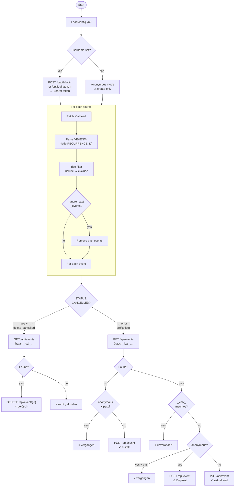

# How cal2gancio works

## Program flow

## Stateless sync via internal tags

cal2gancio keeps no local state file. Instead, every synced event carries two internal Gancio tags:

| Tag              | Purpose                                                    |
| ---------------- | ---------------------------------------------------------- |
| `_ical_{hash}`   | Stable identity key derived from the iCal `UID`            |
| `_icalv_{hash}`  | Content fingerprint; changes when any event field changes  |

On each run, for every iCal event:

1. Search Gancio for an event with the matching `_ical_` tag
2. **Not found** → create (POST)
3. **Found, `_icalv_` matches** → skip (nothing changed)
4. **Found, `_icalv_` differs** → update (PUT); the new content tag replaces the old one

This works correctly across multiple machines and survives restarts without any local state.

> **Note:** Events without a `UID` field use `title + start_timestamp` as a fallback identity key. If their title or date changes they will be duplicated rather than updated. Well-maintained feeds always export proper UIDs.

## Anonymous mode

When running without `username`, events are submitted anonymously and placed in Gancio's **pending/unconfirmed** queue. Pending events are not returned by the public events API, so a freshly submitted anonymous event is invisible on the next run.

Once an admin approves (publishes) an event, it becomes visible and the stateless lookup works again:

| Lookup result                                | Action                                       |
| -------------------------------------------- | -------------------------------------------- |
| Not found (still pending or never created)   | create — `✓ erstellt`                        |
| Found, content unchanged (`_icalv_` matches) | skip — `= unverändert`                       |
| Found, content changed (`_icalv_` differs)   | create new version — `⚠ erstellt (Duplikat)` |

The third case creates a duplicate because `PUT /api/event` always requires authentication.

**Use credentials (`username` + `password_file`) for full create / update / skip support.**

## Supported iCal fields

| iCal field            | Gancio field / behaviour                                          |
| --------------------- | ----------------------------------------------------------------- |
| `SUMMARY`             | `title`                                                           |
| `DESCRIPTION`         | `description`                                                     |
| `DTSTART`             | `start_datetime`                                                  |
| `DTEND` > 24 h        | `multidate`                                                       |
| `DURATION`            | used for `multidate` when `DTEND` is absent                       |
| `LOCATION`            | `place_name` + `place_address`                                    |
| `GEO`                 | `place_latitude` / `place_longitude`                              |
| `CATEGORIES`          | `tags`                                                            |
| `ATTACH` (image URL)  | `image_url`                                                       |
| `URL`                 | clickable link in description (label via `text.event_link`)       |
| `EXDATE`              | excluded recurrence dates (tracked in content hash)               |
| `STATUS: CANCELLED`   | title-prefix or delete, depending on `delete_cancelled`           |
| `RRULE` weekly        | `recurrent[frequency]` → `1w` / `2w`                             |
| `RRULE` monthly       | `recurrent[frequency]` → `1m` / `2m` (no `BYDAY`)                |
| `RRULE` yearly        | `recurrent[frequency]` → `1y`                                     |
