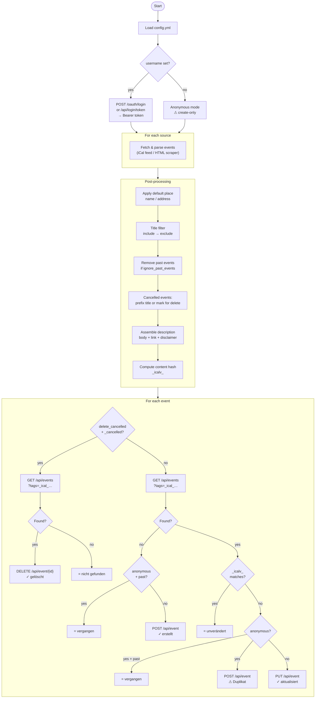

# How cal2gancio works

## Program flow

## Stateless sync via internal tags

cal2gancio keeps no local state file. Instead, every synced event carries two internal Gancio tags:

| Tag              | Purpose                                                    |
| ---------------- | ---------------------------------------------------------- |
| `_ical_{hash}`   | Stable identity key derived from the event `UID`           |
| `_icalv_{hash}`  | Content fingerprint; changes when any event field changes  |

On each run, for every event:

1. Search Gancio for an event with the matching `_ical_` tag
2. **Not found** → create (POST)
3. **Found, `_icalv_` matches** → skip (nothing changed)
4. **Found, `_icalv_` differs** → update (PUT); the new content tag replaces the old one

This works correctly across multiple machines and survives restarts without any local state.

> **Note:** Events without a stable `UID` use the source URL as a fallback identity key (HTML source) or `title + start_timestamp` (iCal without UID). If these change, the event will be duplicated rather than updated.

## Anonymous mode

When running without `username`, events are submitted anonymously and placed in Gancio's **pending/unconfirmed** queue. Pending events are not returned by the public events API, so a freshly submitted anonymous event is invisible on the next run.

Once an admin approves (publishes) an event, it becomes visible and the stateless lookup works again:

| Lookup result                                | Action                                       |
| -------------------------------------------- | -------------------------------------------- |
| Not found (still pending or never created)   | create — `✓ erstellt`                        |
| Found, content unchanged (`_icalv_` matches) | skip — `= unverändert`                       |
| Found, content changed (`_icalv_` differs)   | create new version — `⚠ erstellt (Duplikat)` |

The third case creates a duplicate because `PUT /api/event` always requires authentication.

**Use credentials (`username` + `password_file`) for full create / update / skip support.**

## Source types

| Source type | Description | Documentation |
| ----------- | ----------- | ------------- |
| `ical`      | Standard iCal/ICS feed URL | [docs/sources/ical.md](sources/ical.md) |
| `html`      | HTML page scraper with optional per-event iCal | [docs/sources/html.md](sources/html.md) |
